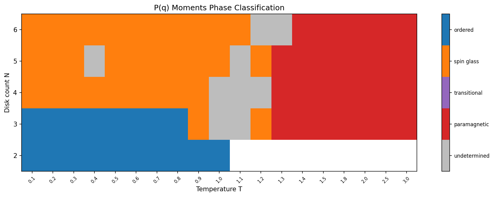
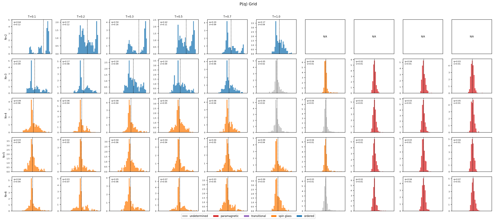
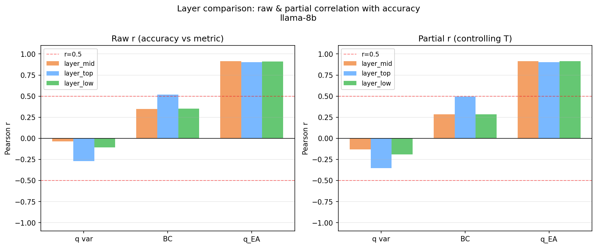

<!-- _class: title -->

# LLMの推論行き詰まりを統計力学で測る

## Tower of Hanoi 実験による相転移の観測

発表者：（発表者名）

2026年5月27日

---

<!-- _class: toc -->

## 今日話す内容

**今日のゴール：LLMの推論挙動を物理で測る第一歩を見てもらう**

1. LLMが「行き詰まる」という現象を知ってもらう
2. その行き詰まりを**統計力学**の言葉で記述する枠組みを説明する
3. Tower of Hanoi 実験で実際に何が見えたかを報告する
4. 最終ゴール（制御モデル）への道筋を示す

```
現在地 → [ 相転移の観測 ] → [ ハミルトニアン構築 ] → [ 制御モデル ]
                 ↑今日ここ
```

---

## LLM って何をしているの？

ChatGPT や DeepSeek のような**大規模言語モデル（LLM）**は、
与えられた文の続きをトークン（単語のかけら）単位で予測する機械。

```
入力:  "ハノイの塔の第1手は"
出力:  "ディスク1をCに移す" ← 確率的に選ぶ
```

**温度パラメータ $T$** がランダム性を制御：

- $T$ が低い → 確率の高い答えを選ぶ（保守的）
- $T$ が高い → ランダムな答えを選ぶ（暴走気味）

**賢く見えるが、複雑な問題では行き詰まることがある。**

---

## LLMが行き詰まる現象

実際に LLM にパズルを解かせると、こんな失敗が起きる：

**現象 1：move loop（手の繰り返し）**

```
ディスク1をAからCへ
ディスク1をCからAへ
ディスク1をAからCへ  ← 同じ手を繰り返す
ディスク1をCからAへ
...（無限ループ）
```

**現象 2：no move（手が出ない）**

```
ディスク2をAからBへ
（次の手を出せずに停止）
```

なぜ重要か？→ 行き詰まりを**検出・回避**できれば推論の質が上がる。

これを記述・制御するために**物理学のフレームワーク**を使う。

---

## Tower of Hanoi をパズルに選んだ理由

**Tower of Hanoi（ハノイの塔）のルール：**

```
初期状態                 ゴール状態
  |                         |
 [1]                       [1]
 [2]                       [2]
 [3]                       [3]
  A    B    C         A    B    C
```

- 3本の棒（A, B, C）と $N$ 枚のディスク
- 一度に1枚だけ移動可能；大きいディスクを小さい上には置けない
- $N$ 枚のとき最小手数は $K(N) = 2^N - 1$ 手

**選んだ理由：**
- **解が一意**（成功・失敗を明確に判定できる）
- **$N$ を変えることで難しさを調節できる**（$N$ 大 = エネルギー障壁大）
- 状態空間の構造が明確（物理モデルとの対応付けが容易）

---

## 実験設定の概要

LLM に Tower of Hanoi を解かせ、**精度と隠れ状態**を記録する

**制御パラメータ：**

| パラメータ | 物理的意味 | 範囲 |
|---|---|---|
| $T$（生成温度） | 熱浴温度・ランダム性の強さ | 0.2 〜 2.0 |
| $N$（ディスク数） | 問題の複雑度・エネルギー障壁 | 2 〜 6 |

**測定量：**
- **正解率** $m$（秩序変数）：25 試行中何回ゴールに到達したか
- **隠れ状態** $\mathbf{h}$：各 Move 直後のモデル内部ベクトル（$d \sim 4096$ 次元、3層）
- **early_stop ラベル**：どのように行き詰まったか

モデル：DeepSeek-R1-Distill-Qwen-7B（現在解析完了）

---

## early_stop とは何か

「実験が早期に終わった理由」を分類したラベル：

| ラベル | 何が起きたか | 対応する相（暫定） |
|---|---|---|
| `goal_reached` | ゴールに到達した | **秩序相 (Ordered)** |
| `move_loop_repeat` | 同じ手を繰り返した | **スピングラス相 (SG)** |
| `move_loop_reverse` | 行ったり来たりした | **スピングラス相 (SG)** |
| `no_move_catchall` | 手を出せなかった | **常磁性相 (PM)** |
| `move_ceiling` | 手数が上限を超えた | **常磁性相 (PM)** |

**直感的なイメージ：**
- Ordered = 正解できた
- SG = ループ（局所的な谷に捕まった）
- PM = 完全にランダムで制御不能

---

## 相転移とは何か？（統計力学の直感）

**身近な例：水は温度で状態が変わる**

```
低温        中温        高温
  氷    →   水    →   水蒸気
（固体）   （液体）   （気体）
```

温度 $T$ を上げると**突然**状態が切り替わる = **相転移**

**LLMの推論でも同じことが起きている？**

```
低 T          中 T          高 T
  正解    →  ループ    →   無手
（Ordered）  （SG）        （PM）
     ↓           ↓            ↓
 水（秩序）  スピングラス  気体（無秩序）
```

$T$ と $N$（問題の難しさ）を変えることで、LLMの「状態」が切り替わるかどうかを調べる。

---

## スピングラスとは何か？（B4向け直感）

**通常の磁石（強磁性体）：**

```
↑ ↑ ↑ ↑ ↑   全部同じ方向を向く = 秩序
```

**スピングラス：**

```
↑ ↓ ↑ ↑ ↓   ランダムな相互作用のせいで
↓ ↑ ↓ ↑ ↑   決まった向きにもなれず
↑ ↑ ↓ ↓ ↑   完全ランダムにもなれない中間状態
```

**スピングラスの特徴：**
- 「局所的に安定な状態」（メタ安定状態）が多数存在
- どの状態に落ちるかは初期条件次第でバラバラ
- 外から見ると「決まっていない」ように見えるが内側には構造がある

**LLMの move loop との対応：**
→ ループに捕まっている = ポテンシャルの局所的な谷に落ちている
→ 複数の「ループパターン」のどれかに捕まる = メタ安定状態への収束

---

<!-- PHYSICS-REVIEW-START -->

<!-- _class: equation -->

## 理論枠組み ─ ハミルトニアンの定義

LLM 推論を**エネルギーポテンシャル上を動く粒子**としてモデリングする。

**Hopfield 型ハミルトニアン** <!-- eq:hamiltonian -->

$$
\mathcal{H}(\mathbf{h}) = -\frac{1}{2N_p} \sum_{\mu=1}^{K(N)} \left( \boldsymbol{\xi}^{\mu} \cdot \mathbf{h} \right)^2
$$

各記号の意味：
- $\mathbf{h} \in \mathbb{R}^d$：LLMの隠れ状態（今の「思考」を表すベクトル）
- $\boldsymbol{\xi}^{\mu}$：$\mu$ 番目の「記憶パターン」（正解手順のステップ）
- $K(N) = 2^N - 1$：最短解の手数（= 記憶するパターン数）
- $N_p$：正規化定数

**秩序変数 $m$（磁化に対応）：** <!-- eq:order_param -->

$$
m = \frac{1}{R} \sum_{a=1}^{R} \mathbf{1}[\text{trial } a \text{ が正解}]
$$

$m \to 1$：秩序相（正解到達）、$m \to 0$：無秩序相（行き詰まり）

---

<!-- _class: equation -->

## P(q) とは何か？

**試行間の隠れ状態の「似ている度」を分布にしたもの**

**重複（overlap）$q_{ab}$ の定義：** <!-- eq:q_ab -->

$$
q_{ab} = \frac{\mathbf{h}^{(a)} \cdot \mathbf{h}^{(b)}}{|\mathbf{h}^{(a)}||\mathbf{h}^{(b)}|}
$$

$a, b$：異なる試行番号（レプリカ添字）；$q_{ab} \in [-1, 1]$（コサイン類似度）

**Edwards-Anderson 秩序変数：** <!-- eq:q_ea -->

$$
q_{EA} = \sqrt{\langle q^2 \rangle}
$$

**$P(q)$ 分布が相を反映する：**

```
一峰（P(q) が一か所に集中）     双峰（P(q) が二か所に分裂）
      ┌──┐                            ┌─┐   ┌─┐
      │  │                            │ │   │ │
──────┘  └────                   ─────┘ └───┘ └─────
   q ≈ 1 （Ordered）              q≈-1  q≈+1  （SG）
      または q ≈ 0 （PM）
```

<!-- PHYSICS-REVIEW-END -->

---

<!-- _class: flow -->

## 実験で何を測っているか

**実験パイプラインの概要：**

```
1. LLMに Tower of Hanoi を解かせる（25 試行）
      ↓
2. 各 Move 直後の隠れ状態 h を保存（.npz ファイル）
      ↓  layer_top（最終層）/ layer_mid（中間層）/ layer_low（浅い層）の3層
      ↓
3. 全試行ペア (a, b) のコサイン類似度 q_{ab} を計算
      ↓  25試行 → 25×24/2 = 300 ペア
      ↓
4. q_{ab} を集めて P(q) 分布を作る
      ↓
5. P(q) の形（一峰 or 双峰）から相を判定
```

**測定量の整理：**
- 精度 $m$：秩序変数（直接の成否）
- $q_{EA}$：hidden state の「試行間一貫性」を測る独立指標
- $P(q)$：相の「証拠」（ラベルなしで相を同定できるか？）

---

<!-- _class: figure-full -->

## 実験結果 ─ 精度の相図（accuracy heatmap）



**読み方：**
- **左上（低 $T$、小 $N$）**：正解率が高い = 秩序相
- **右側（高 $T$）** / **下側（大 $N$）**：正解率が低い
- **境界線**：相転移点 $T_c(N)$（$N$ が増えると低温側にシフト）

---

<!-- _class: figure-full -->

## 実験結果 ─ P(q) 分布の代表例



**読み方：**
- **左上（低 $T$、小 $N$）**：鋭いピーク（一峰）= Ordered
- **中央（中 $T$、大 $N$）**：幅広い、または二峰 = SG
- **右側（高 $T$）**：$q \approx 0$ 付近に広がる = PM

$P(q)$ の形は **early_stop ラベルなしでも相を同定できる**可能性がある。

---

## 観測 1 ─ N 駆動の秩序崩壊

**ディスク数 $N$ を増やすと、同じ温度でも秩序が崩壊する**

| $N$ | 特徴 |
|---|---|
| $N=2$ | 広い温度範囲で正解可能（$T \lesssim 1.5$ まで Ordered） |
| $N=3$ | 低 $T$ は Ordered、$T \gtrsim 1.0$ で SG → PM へ遷移 |
| $N=4$ | 低温でも SG が混在し始める |
| $N=5,6$ | ほぼ全域で崩壊 |

**物理的解釈：**
- $N$ が増える = 最短解 $K(N) = 2^N - 1$ が指数的に増加
- = 記憶すべきパターン数が指数増大 → 容量を超えると局所安定状態に落ちやすくなる
- Hopfield 模型の**容量限界**（$\alpha_c \approx 0.138 N_p$）に対応

---

## 観測 2 ─ T 駆動の遷移

**温度 $T$ を上げると Ordered → SG → PM の順に遷移する**

**暫定転移温度（$N=3$, DeepSeek-R1-Distill-Qwen-7B）：**

| 転移 | 温度 |
|---|---|
| Ordered → SG | $T_{c1}(N=3) \approx 1.0$ |
| SG → PM | $T_{c2}(N=3) \approx 1.15$ |

**$T$ 別の試行結果内訳（$N=3$）：**

| $T$ | 正解率 $p_\text{goal}$ | ループ率 $p_\text{loop}$ | PM率 $p_\text{PM}$ |
|---|---|---|---|
| 0.1–0.6 | 0.36–0.68 | 0.08–0.28 | 0.16–0.48 |
| 0.7–1.0 | 0.12–0.36 | 0.28–0.32 | 0.32–0.56 |
| 1.1 | 0.00 | 0.10 | 0.90 |
| ≥1.2 | 0.00 | 0.00 | 1.00 |

SG シグナルは $T = 0.7$〜$1.0$ でピーク、$T \geq 1.2$ で消滅 = PM 相に飲み込まれる。

---

## P(q) で見る 3 相の証拠

**H3仮説（move loop = 局所安定状態）の支持証拠：**

EXP-001（86 セル分析）の結果：

| 領域 | P(q) の形状 | 解釈 |
|---|---|---|
| $N=2$, 全 $T$ | 鋭い一峰（$q \approx 1$） | Ordered — 毎回同じ経路 |
| $N=3$, 低 $T$ | 一峰 | Ordered |
| $N=3$, $T \approx 0.7$–$1.0$ | 幅広 or やや双峰 | SG 的な揺らぎ |
| $N=4$–$6$, SG セル | **P(q) 双峰性を確認** | SG 相の直接的証拠 |
| 高 $T$ | $q \approx 0$ の幅広一峰 | PM — 試行ごとにバラバラ |

**結論：** $P(q)$ 双峰性は SG 相（ループ固着）の**独立した証拠**として機能する。
ラベルベースの分類と整合 → **H3 は supported 状態**。

---

<!-- _class: figure-left -->

## 散逸構造・$q_{EA}$ と精度の関係

<div class="fig-layout">
  <div class="fig-left">
    
    <p class="fig-caption">図3: 層別（layer_top / layer_mid / layer_low）の $q_{EA}$ と精度 $m$ の関係。各点が1つの $(T, N)$ セル。$q_{EA}$ が大きいほど精度が高い傾向が、温度 $T$ を制御した後も残る。</p>
  </div>
  <div class="fig-right">

**重要な発見：**
- $q_{EA}$ と精度 $m$ に**正の相関**がある
- $T$ を統制変数として偏相関を取っても相関が残る
- **$q_{EA}$ は $T$ とは独立した精度の予測変数**

**物理的解釈：**

隠れ状態の「試行間一貫性」は温度だけで決まらない。問題の複雑度 $N$ や、モデルの内部構造（どの層を見るか）も影響する。

  </div>
</div>

---

<!-- _class: two-col -->

## 考察 ─ 何がわかって何がわからないか

<div class="two-col-layout">
  <div class="col">
    <p class="col-title">わかったこと</p>

- $(T, N)$ 平面に **Ordered / SG / PM の 3 相構造**が存在する
- $N=4$–$6$ の SG セルで **$P(q)$ 双峰性**が観測された（H3 supported）
- $q_{EA}$ は $T$ を制御した後も精度の**独立予測変数**として機能する

  </div>
  <div class="col">
    <p class="col-title">現在検証中 / わからないこと</p>

- **相境界のスケーリング則** $T_c(N) = A \cdot N^{-\alpha_s}$ の指数 $\alpha_s$ は未確定
- 残り 3 モデルの相図 = **普遍性の検証が未着手**
- **SG 判定基準の定量化**（$P(q)$ 双峰性の数値化 = 再設計中）
- **制御外力**と実推論の対応付け（H4 段階2, 未検証）

`open_questions.md` の U2〜U5 に記録済み

  </div>
</div>

---

<!-- _class: flow -->

## 最終ゴールと次のステップ

**制御モデル構築への 3 段階ロードマップ：**

```
段階 1（完了）          段階 2（進行中）        段階 3（最終ゴール）
相図の観測              ハミルトニアン構築      制御モデル実装
P(q) 双峰性確認   →    ポテンシャル上    →    外力挿入で SG 相
H3 supported          の粒子シミュレーション   → Ordered 相へ
7B モデル 86 セル      H4 の検証              推論時の駆動設計
```

**次の優先タスク：**
1. 残り 3 モデルのスイープ実行（普遍性確認）
2. $P(q)$ 双峰性の定量基準確立（U2 解消）
3. Hopfield ハミルトニアンのフィッティング（3 モデリング案の検証）

**締切：2026-06-30** モデリング完了、**2026-07** 中間報告

---

<!-- _class: summary -->

## まとめ ─ Take-home messages

- **LLMの推論行き詰まりを統計力学の相転移として記述できる**：move loop → SG 相、no move → PM 相、goal reached → Ordered 相

- **Tower of Hanoi で $(T, N)$ 相図を描くと 3 相構造が現れる**：$N$ を増やす / $T$ を上げると Ordered → SG → PM へ遷移。7B モデルで 86 セルの相図を取得済み

- **$P(q)$ 双峰性でスピングラス相を同定し、制御モデルへつなぐ**：H3（move loop = 局所安定状態）が $P(q)$ 解析で支持。$q_{EA}$ は精度の独立予測変数 → 制御指標として使える可能性

---

<!-- _class: flow -->

## 補足 ─ 実験パイプラインの全体像

```
run_local.py 実行
  │
  ├─ meta.json を自動生成（実験開始直後）
  │
  ├─ 各試行：LLM → moves 評価 → accuracy 記録
  │          Move 完了直後に隠れ状態を npz に追記
  │          （layer_top / layer_mid / layer_low）
  │
  └─ 全試行完了後に summary.json を保存

bash db/sync.sh
  └─ meta.json を検出して PostgreSQL に取り込む

analysis/run_pipeline.py
  └─ summary.json / npz を読み込み
     相図・P(q)・q_EA を解析・描画
```

**計算資源：** RTX 5070, 12 GB VRAM — 14B 級は NF4 量子化で対応

---

## 補足 ─ early_stop 分類の詳細

| 値 | アルゴリズム | 物理的解釈 | 相の対応 |
|---|---|---|---|
| `goal_reached` | run_local.py | ゴール到達 | Ordered |
| `move_loop_repeat` | アルゴリズム C | 同一手の繰り返し | SG |
| `move_loop_reverse` | アルゴリズム C | 往復運動 | SG |
| `no_move_catchall` | アルゴリズム D | 手を出せない | PM |
| `move_ceiling` | アルゴリズム B | 手数上限超過 | PM |
| `stagnation_after_move` | アルゴリズム E | 移動後に停滞 | **未確定**（SG/PM 両解釈） |
| `think_budget` | アルゴリズム A | 思考トークン上限 | 相分類から除外（打ち切り） |

**注意：** `stagnation_after_move` の相対応は現在検証中（`open_questions.md` U2 参照）。
現行分類アルゴリズムは physics-agent 審査で**不合格（要再設計）**と判定済み。$P(q)$ ベース再設計を進行中。

---

<!-- _class: two-col -->

## 補足 ─ 相分類の問題点と再設計

<div class="two-col-layout">
  <div class="col">
    <p class="col-title">現行分類の問題</p>

- early_stop ラベルは**行動ベース**の分類であり、隠れ状態の統計とは独立
- `stagnation_after_move` が SG と PM のどちらかを判定できていない
- `think_budget`（思考打ち切り）は測定上のアーティファクト（censored data）

  </div>
  <div class="col">
    <p class="col-title">P(q) ベース再設計の方針</p>

- 双峰性指標（$\mathrm{BC}$, dip 検定）で SG 相を客観的に同定
- $q_{EA}$ の計算で相境界を物理的に決定
- ラベルに頼らない**物理的に根拠のある相分類**を目指す

```
ラベルベース（現行）
  early_stop 分類（主観的）
         ↓
P(q) ベース（新方針）
  双峰性指標 → SG 同定
  q_EA → 相境界決定
```

  </div>
</div>

---

## 記号定義表

| コード変数 | 物理記号 | 意味 |
|---|---|---|
| `temperature` | $T$ | 生成温度（熱浴温度・ノイズ強度） |
| `N` | $N$ | ディスク数（系のサイズ・エネルギー障壁高さ） |
| `accuracy` | $m$ | 秩序変数（試行平均正解率） |
| `num_moves` | $n_{\text{moves}}$ | 生成した手数 |
| `q_ea` | $q_{EA}$ | Edwards-Anderson 秩序変数 $= \sqrt{\langle q^2 \rangle}$ |
| `q_mean` | $\langle q \rangle$ | 重複 $q$ の平均 |
| `q_var` | $\mathrm{Var}(q)$ | 重複 $q$ の分散 |
| `q_bimodality_bc` | $\mathrm{BC}$ | Sarle の bimodality coefficient |
| `q_dip_pval` | $p_{\mathrm{dip}}$ | Hartigan dip 検定の $p$ 値（双峰性の検定） |
| `layer_top` | $h_{\text{top}}$ | 最終層（depth 100%）の隠れ状態 |
| `layer_mid` | $h_{\text{mid}}$ | 中間層（depth 50%）の隠れ状態 |
| `layer_low` | $h_{\text{low}}$ | 浅い層（depth 25%）の隠れ状態 |
| `K(N)` | $K(N) = 2^N - 1$ | 最短解の手数（記憶パターン数） |
| `goal_reached` | Ordered | 秩序相（正解到達） |
| `move_loop_*` | SG | スピングラス相（ループ停滞） |
| `no_move_catchall` / `move_ceiling` | PM | 常磁性相（手が出ない / 手数超過） |
